# Self-Healing GitOps Platform

A fully local DevOps project: push code to GitHub, and a pipeline builds, scans and publishes a container image. Argo CD keeps a Kubernetes cluster in sync with the repo, and Prometheus + Grafana monitor the app. No cloud account needed.

## Architecture

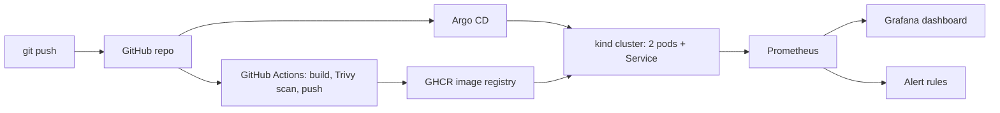

## Tech stack

| Area | Tools |
|---|---|
| App | Python, Flask, Gunicorn, prometheus-client |
| Containers | Docker (non-root user, patched base image) |
| Orchestration | Kubernetes (kind) |
| CI | GitHub Actions, GHCR |
| Security | Trivy image scanning |
| GitOps / CD | Argo CD (auto-sync, self-heal, prune) |
| Monitoring | Prometheus, Grafana, Alertmanager (kube-prometheus-stack via Helm) |

## How it works

1. **App:** a small Flask service with `/` (main endpoint), `/health` (used by Kubernetes probes) and `/metrics` (Prometheus format, includes a custom `app_requests_total` counter).
2. **CI:** on every push that touches `app/`, GitHub Actions builds the image, scans it with Trivy, and only pushes it to GHCR if there are no fixable HIGH/CRITICAL vulnerabilities. Images are tagged `latest` and with the commit SHA.
3. **CD:** Argo CD watches the `k8s/` folder in this repo and applies whatever is there to the cluster. Manual changes to the cluster are reverted automatically.
4. **Self-healing:** the Deployment keeps 2 replicas running, with readiness and liveness probes on `/health`. If a pod dies, Kubernetes replaces it.
5. **Monitoring:** a ServiceMonitor tells Prometheus to scrape the app every 15 seconds. Grafana graphs request rate, and PrometheusRules alert when the app has fewer than 2 healthy replicas or can't be scraped.

## Demos

### CI security gate: Trivy blocks a vulnerable image
The first scan found a HIGH-severity CVE in a Debian base-image package (`libpcre2`). The pipeline failed and nothing was pushed. After adding `apt-get upgrade` to the Dockerfile, the scan came back clean and the image was published.

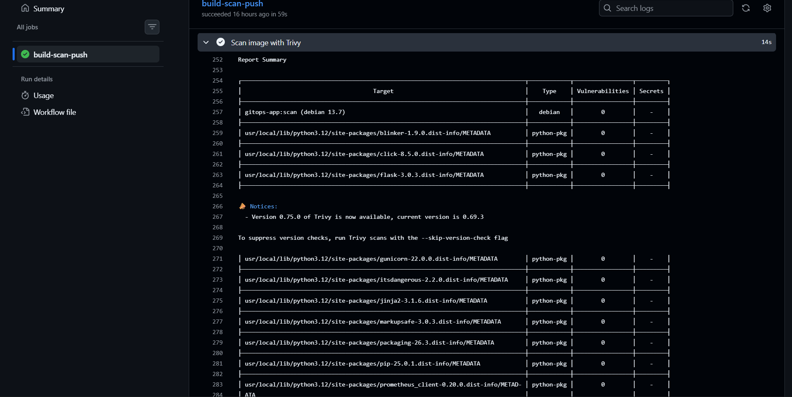
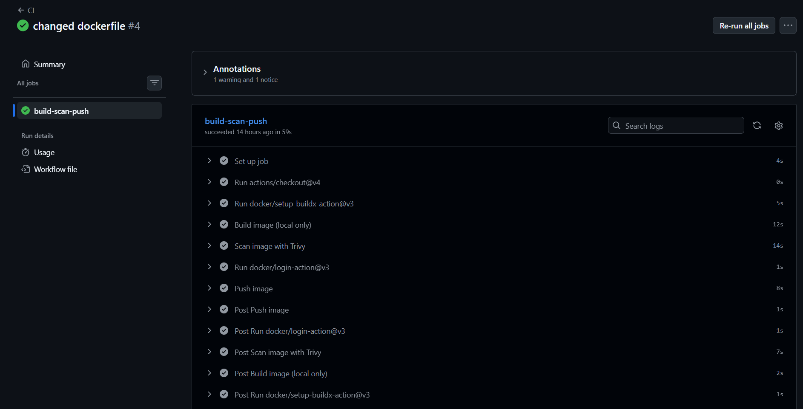
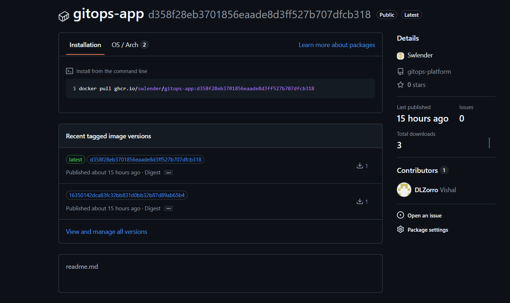

### Kubernetes: 2 replicas and automatic pod recovery
Deleting a pod makes the Deployment create a replacement within seconds.

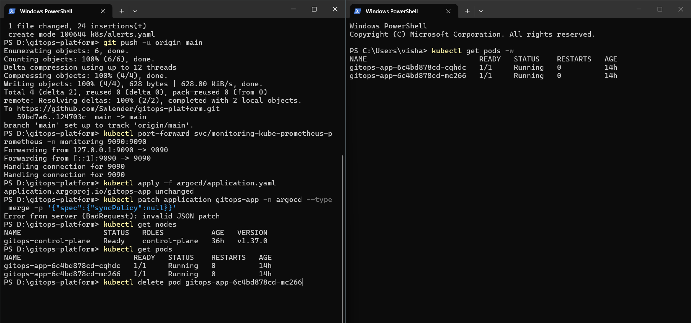
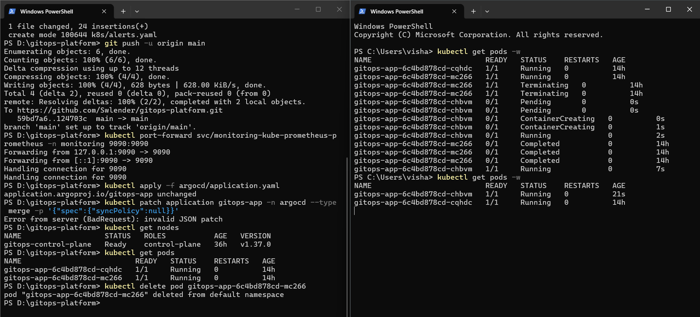

### GitOps with Argo CD
Argo CD shows the app as Synced and Healthy.

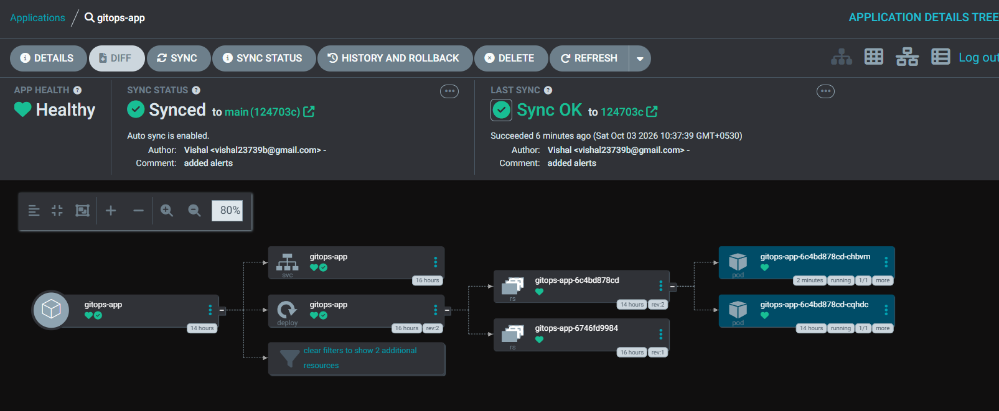

**Git is the source of truth:** changing `replicas` from 2 to 4 in `deployment.yaml` and pushing scaled the app with no `kubectl` commands.

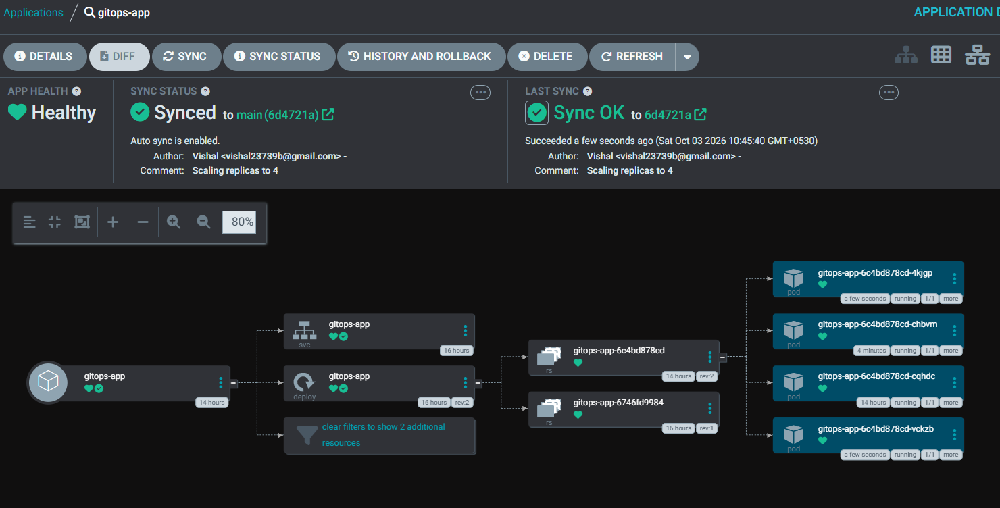

**Drift correction:** a manual `kubectl scale --replicas=5` was reverted by Argo CD automatically.

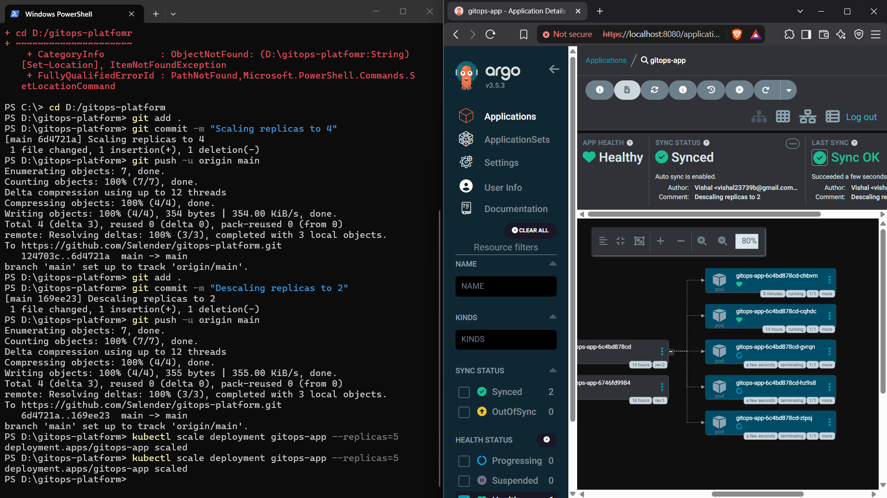

### Monitoring and alerting
Prometheus scrapes the app, and Grafana shows the request rate from the custom metric.

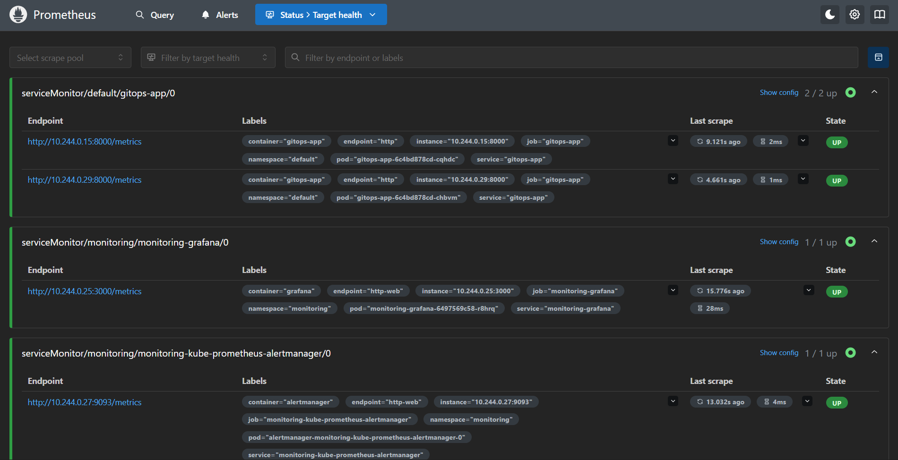
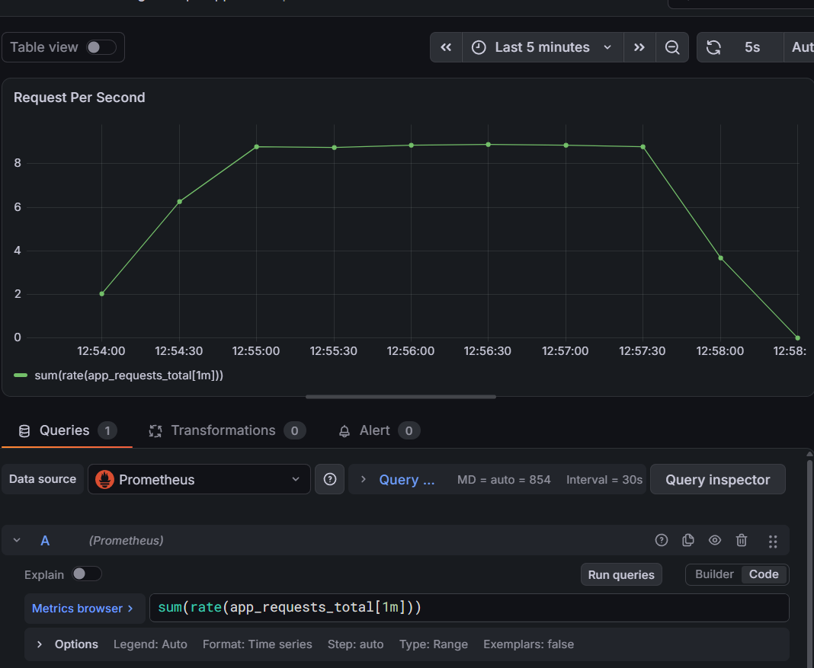

Scaling the app to 0 replicas (with Argo auto-sync paused) triggered the `GitopsAppLowReplicas` alert.

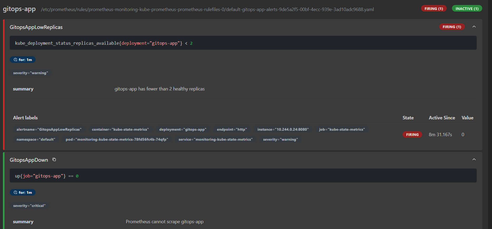

## Repository layout

```
.
├── app/                    Flask app, Dockerfile, requirements
├── k8s/                    Deployment, Service, ServiceMonitor, alert rules
├── argocd/application.yaml Argo CD Application (auto-sync + self-heal)
├── .github/workflows/      CI pipeline (build, scan, push)
└── docs/screenshots/       Images used in this README
```

## Run it locally

**Prerequisites:** Docker Desktop, [kind](https://kind.sigs.k8s.io/), kubectl, Helm.

```bash
# 1. Create the cluster
kind create cluster --name gitops

# 2. Install the monitoring stack (first, so its CRDs exist)
helm repo add prometheus-community https://prometheus-community.github.io/helm-charts
helm repo update
helm install monitoring prometheus-community/kube-prometheus-stack \
  -n monitoring --create-namespace \
  --set prometheus.prometheusSpec.serviceMonitorSelectorNilUsesHelmValues=false

# 3. Install Argo CD
kubectl create namespace argocd
kubectl apply -n argocd --server-side --force-conflicts \
  -f https://raw.githubusercontent.com/argoproj/argo-cd/stable/manifests/install.yaml

# 4. Point Argo CD at this repo
kubectl apply -f argocd/application.yaml
```

Then open the UIs with port-forwards:

```bash
kubectl port-forward svc/argocd-server -n argocd 8080:443                          # https://localhost:8080
kubectl port-forward svc/monitoring-grafana -n monitoring 3000:80                  # http://localhost:3000
kubectl port-forward svc/monitoring-kube-prometheus-prometheus -n monitoring 9090:9090
kubectl port-forward svc/gitops-app 8000:80                                        # http://localhost:8000
```

The GHCR package must be public so the cluster can pull the image without credentials.

## Notes and limitations

- The image tag in `k8s/deployment.yaml` is updated by hand after CI publishes a new image. Automating this is the next planned step.
- On kind, Prometheus shows the control-plane targets (etcd, scheduler, controller-manager, kube-proxy) as down because they only listen on localhost inside the node. This is expected and doesn't affect the app.
- Alerts are visible in Prometheus; no notification receiver (Slack/email) is configured yet.

## Next steps

- Auto-update the image tag in Git from CI so a push flows all the way to the cluster
- Pin GitHub Actions to commit SHAs
- Send alerts to Slack via Alertmanager
- Provision the same setup on a managed cluster (EKS/AKS) with Terraform
